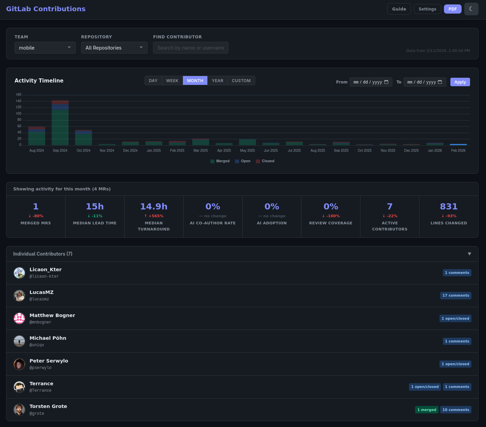
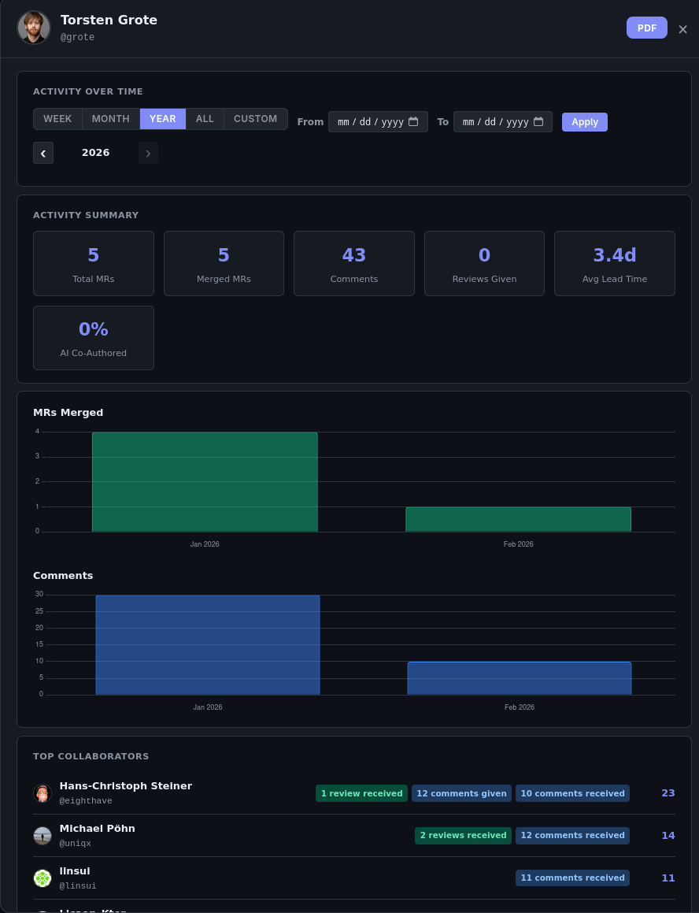

# GitLab Contributions Tracker


A lightweight dashboard that displays team-level aggregate metrics and individual contributor activity across multiple GitLab repositories. Designed to surface team health indicators for managers, with individual activity data available for coaching conversations — no ranking, scoring, or competitive badges.

## Features

- **Team aggregate metrics** — 8 key metrics (merged MRs, median lead time, median turnaround, AI co-author rate, AI adoption, review coverage, active contributors, lines changed) with period-over-period trend indicators
- **Multi-repository tracking** — Configure multiple GitLab repositories in YAML
- **Team-based organization** — Group repositories by teams and filter by team
- **AI co-authorship tracking** — Detects AI-assisted MRs via description trailers (Co-Authored-By, Generated-By, etc.) and tracks adoption across the team
- **Jira integration** — Extract bug priority from MR titles
- **Interactive timeline** — Click timeline bars to filter aggregate metrics and contributor list by specific time periods
- **Individual contributor list** — Collapsible alphabetical list with activity badges; click to view detailed activity, charts, collaborators, and repository breakdown
- **Interactive tooltips** — Hover over metric cards and activity badges for descriptions
- **PDF export** — Team activity report and individual activity report
- **Dark/light themes** — Responsive UI with theme switching

## Demo

### Live Demo

🚀 **Try it now:** [https://my1.fr/glab-stats/](https://my1.fr/glab-stats/)

### Fetching Data

<a href="https://asciinema.org/a/CxaKkJVrwyEZ3YBH"></a>

### Dashboard Screenshot



### Individual View ScreenShot



## Quick Start

1. **Install dependencies**
   ```bash
   pip install -r requirements.txt
   ```

2. **Set environment variables**
   ```bash
   export GITLAB_TOKEN="glpat-your-token-here"
   export JIRA_API_TOKEN="your-jira-token"  # Optional
   ```

3. **Configure repositories**

   Edit `repos.yaml` to organize repositories by team:
   ```yaml
   repositories:
     backend-team:
       - url: https://gitlab.com/your-org/api-service
       - url: https://gitlab.com/your-org/user-service
     frontend-team:
       - url: https://gitlab.com/your-org/web-app
     docs-team:
       - url: https://gitlab.com/your-org/documentation
         skip_scoring: [lines]  # Exclude LOC for docs repos
   ```

4. **Fetch data**
   ```bash
   python fetch_data.py -n 50  # Fetch 50 most recent MRs per repo

   # Additional options:
   python fetch_data.py -n 100 -w 8              # Use 8 workers for faster fetching
   python fetch_data.py -r custom-repos.yaml     # Use custom repos config file
   python fetch_data.py -n 30 -w 6 -r repos.yaml # Combine options
   ```

   **Options:**
   - `-n, --limit`: Number of most recent MRs to fetch per repo (default: 20)
   - `-w, --workers`: Number of concurrent threads for fetching MR details (default: 4)
   - `-r, --repos`: Path to repos configuration file (default: repos.yaml)

5. **Run the UI**
   ```bash
   cd frontend
   python -m http.server 8080
   ```

   Open http://localhost:8080 in your browser.

## Configuration

- **Team filtering** — Use the team dropdown to filter contributors and repositories by team
- **Repository filtering** — Add `skip_scoring: [lines, comments, approvals]` to exclude categories per repo
- **Settings** — Two options: "Show All Teams" toggle and "AI Adoption Threshold" (percentage of AI co-authored MRs a contributor needs to be counted in the AI Adoption metric, default 30%)
- **Jira integration** — Extracts ticket IDs from MR titles (e.g., `RHEL-1234: fix bug`)

### AI Co-Authorship Detection

MR descriptions are scanned for trailers indicating AI collaboration:

- `Co-Authored-By:` / `Generated-By:` / `Assisted-By:` / `AI-Agent:`
- `Generated with:` / `Created with:` / `Built with:` / `Powered by:`

These are matched against known AI tools (Claude, ChatGPT, Copilot, Gemini, Cursor, etc.). When detected, the MR is flagged as AI co-authored, contributing to:

- **AI Co-Author Rate** — Percentage of MRs co-authored with AI in the period
- **AI Adoption** — Percentage of contributors meeting the AI usage threshold
- **AI badge** — Shown on individual contributors in the contributor list

## License

Apache 2.0 - see [LICENSE](LICENSE) file.
