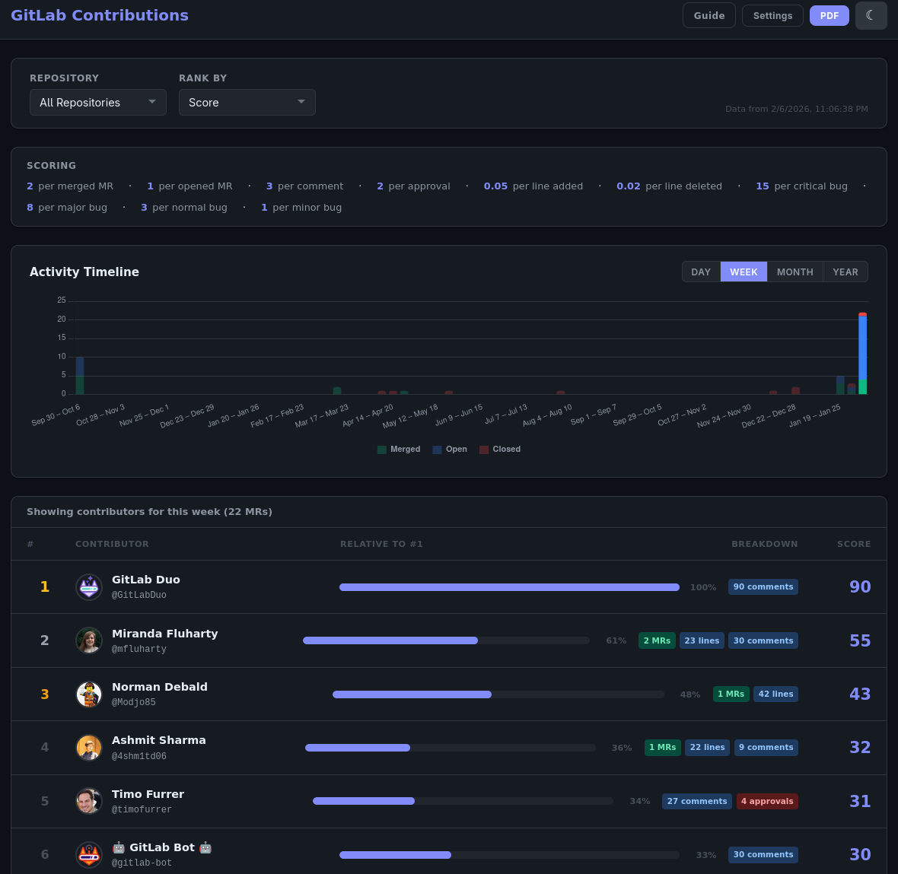

# GitLab Contributions Tracker


A lightweight dashboard that tracks merge request contributions across GitLab repositories.
It ranks contributors using a configurable scoring system based on MRs authored, comments, approvals, lines of code, and Jira bug priority.

## Features

- **Multi-repository tracking** — Configure multiple GitLab repositories in YAML
- **Configurable scoring** — Customizable weights for different contribution types
- **Jira integration** — Extract bug priority from MR titles and include in scoring
- **Interactive timeline** — Click timeline bars to filter by specific time periods
- **Progress tracking** — Monitor contributor activity trends over time with visual progress metrics
- **Multiple metrics** — Score, MR count, lines of code, comments, approvals, bug priority
- **PDF export** — Generate reports with charts and contributor tables
- **Dark/light themes** — Responsive UI with theme switching

## Demo

### Fetching Data

<a href="https://asciinema.org/a/tKBlKcDrEo0XHIWp"></a>

### Dashboard Screenshot



## Quick Start

1. **Install dependencies**
   ```bash
   pip install -r requirements.txt
   ```

2. **Set environment variables**
   ```bash
   export GITLAB_TOKEN="glpat-your-token-here"
   export JIRA_API_TOKEN="your-jira-token"  # Optional
   ```

3. **Configure repositories**

   Edit `repos.yaml`:
   ```yaml
   repositories:
     - url: https://gitlab.com/your-org/repo1
     - url: https://gitlab.com/your-org/repo2
       skip_scoring: [lines]  # Exclude LOC for docs repos
   ```

4. **Fetch data**
   ```bash
   python fetch_data.py -n 50  # Fetch 50 most recent MRs per repo

   # Additional options:
   python fetch_data.py -n 100 -w 8              # Use 8 workers for faster fetching
   python fetch_data.py -r custom-repos.yaml     # Use custom repos config file
   python fetch_data.py -n 30 -w 6 -r repos.yaml # Combine options
   ```

   **Options:**
   - `-n, --limit`: Number of most recent MRs to fetch per repo (default: 20)
   - `-w, --workers`: Number of concurrent threads for fetching MR details (default: 4)
   - `-r, --repos`: Path to repos configuration file (default: repos.yaml)

5. **Run the UI**
   ```bash
   cd frontend
   python -m http.server 8080
   ```

   Open http://localhost:8080 in your browser.

## Configuration

- **Scoring weights** — Edit `frontend/score-config.json` or use the Settings modal in the UI
- **Repository filtering** — Add `skip_scoring: [lines, comments, approvals]` to exclude categories per repo
- **Jira integration** — Extracts ticket IDs from MR titles (e.g., `RHEL-1234: fix bug`)

## License

Apache 2.0 - see [LICENSE](LICENSE) file.
